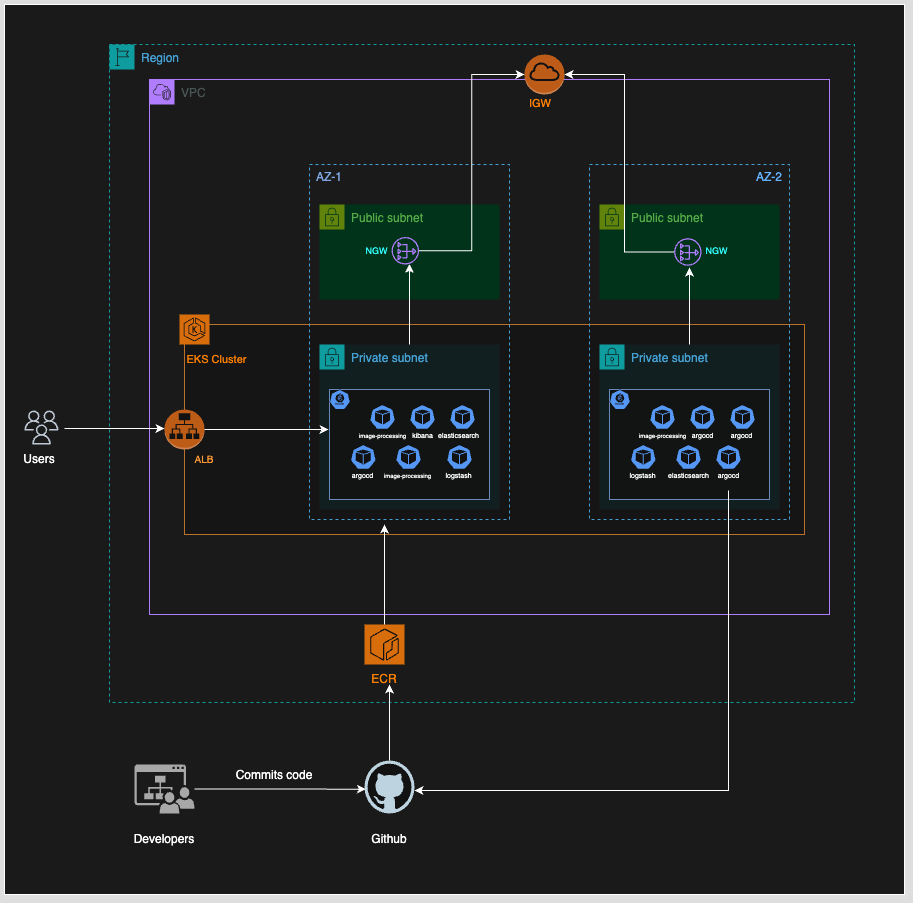

# Image Processing Service Deployment with AWS EKS, Terraform, Helm, Argo CD, and ELK Stack

## Table of Contents
1.  [Overview](#overview)
2.  [Architecture](#architecture)
3.  [Branching Strategy](#branching-strategy)
4.  [Deployment Process](#deployment-process)
5.  [Infrastructure Setup](#infrastructure-setup)
6.  [Application Deployment](#application-deployment)
7.  [Monitoring and Logging](#monitoring-and-logging)
8.  [Troubleshooting](#troubleshooting)
9.  [Jenkins Setup](#jenkins-setup)
10. [Improvements](#improvements)


## Overview
This repository contains the infrastructure code and application configuration for deploying an image-processing service on AWS EKS. The solution is built using Terraform, Helm, and Argo CD to ensure smooth deployment, continuous integration, and monitoring.

## Architecture
- **AWS EKS Cluster**: Main Kubernetes cluster for running the image-processing service
- **Terraform/Terragrunt**: Infrastructure provisioning and management
- **Helm**: Kubernetes package management
- **Argo CD**: GitOps deployment tool
- **GitHub Actions**: CI/CD automation
- **ELK Stack**: Logging and monitoring
- **Argo CD Rollout**: Blue-green deployment management

## Branching Strategy

### Branch Structure
```
main (production)
  └── staging
      └── feature/*
```

### Branch Workflow
1. **Feature Development**
   - Create feature branch from `staging`
   - Naming convention: `feature/description-of-change`
   - Example: `feature/add-image-resize`

2. **Staging Deployment**
   - Feature branches are merged into `staging`
   - Triggers staging deployment via GitHub Actions
   - Automated testing and validation

3. **Production Deployment**
   - `staging` is merged into `main`
   - Triggers production deployment
   - Blue-green deployment via Argo CD Rollout

## Deployment Process

### 1. Feature Development
```bash
# Create feature branch
git checkout staging
git pull origin staging
git checkout -b feature/new-feature

# Make changes and commit
git add .
git commit -m "feat: add new feature"
git push origin feature/new-feature

# Create Pull Request to staging
# GitHub Actions will trigger staging deployment
```

### 2. Staging Deployment
- Triggered by:
  - Push to `staging` branch
  - PR to `staging` branch
- Process:
  1. GitHub Actions builds Docker image
  2. Pushes to staging ECR repository
  3. Updates Helm chart values
  4. Argo CD detects changes and deploys to staging

### 3. Production Deployment
- Triggered by:
  - Merge to `main` branch
- Process:
  1. GitHub Actions builds production image
  2. Pushes to production ECR
  3. Updates production Helm values
  4. Argo CD deploys using blue-green strategy

## Infrastructure Setup

### Prerequisites
```bash
# Install required tools
brew install terraform terragrunt kubectl helm awscli

# Configure AWS credentials
aws configure
```

### 1. Initialize Infrastructure
```bash
# Clone repository
git clone <repository-url>
cd image-processing

# Initialize Terragrunt
cd terragrunt/env/staging  # or prod
terragrunt run-all init
```

### 2. Deploy Infrastructure
```bash
# Plan infrastructure changes
terragrunt run-all plan

# Apply infrastructure
terragrunt run-all apply
```

### 3. Configure Argo CD
```bash
# Get Argo CD admin password
kubectl -n argocd get secret argocd-initial-admin-secret -o jsonpath="{.data.password}" | base64 -d

# Access Argo CD UI
kubectl port-forward svc/argocd-server -n argocd 8080:443
```

### 4. Detailed Infrastructure Documentation
For detailed infrastructure setup and configuration, refer to the [Terragrunt README.md](terragrunt/README.md) which includes:
- Complete directory structure
- Environment-specific configurations
- Module descriptions
- Common commands and troubleshooting
- Security considerations
- Maintenance procedures

## Application Deployment

### 1. Staging Environment
- Located in: `.github/workflows/staging.yaml`
- Triggers on:
  - PR to `staging`
  - Push to `staging`
- Configuration:
  ```yaml
  ecr_repository: "image-processing-app-ecr-staging"
  aws_region: "us-west-1"
  image_name: "image-processing-app-staging"
  ```

### 2. Production Environment
- Located in: `.github/workflows/production.yaml`
- Triggers on:
  - PR to `main`
  - Push to `main`
- Configuration:
  ```yaml
  ecr_repository: "image-processing-app-ecr-prod"
  aws_region: "us-west-2"
  image_name: "image-processing-app-prod"
  ```

### 3. Argo CD Configuration
- Template: `terragrunt/modules/eks/files/argocd.tmpl`
- Features:
  - Automated sync
  - Self-healing
  - Prune resources
- Configuration:
  ```yaml
  syncPolicy:
    automated:
      prune: true
      selfHeal: true
  ```

## Monitoring and Logging

### 1. Prometheus & Grafana
- Metrics collection
- Performance monitoring
- Custom dashboards

### 2. ELK Stack
- Log aggregation
- Log analysis
- Visualization

### 3. Log Monitoring and Anomaly Detection

#### Prerequisites
Before running log monitoring scripts in an EKS environment, ensure you have the following prerequisites:

1. **AWS CLI Configuration**
   ```bash
   # Install AWS CLI if not already installed
   brew install awscli

   # Configure AWS credentials
   aws configure
   ```
   You'll be prompted for:
   ```
   AWS Access Key ID:     <your-access-key>
   AWS Secret Access Key: <your-secret-key>
   Default region name:   us-east-1   # (or your cluster's region)
   Default output format: json
   ```

2. **EKS Cluster Access**
   ```bash
   # Update kubeconfig for EKS access
   aws eks update-kubeconfig --region <region> --name <cluster-name>
   
   # Example
   aws eks update-kubeconfig --region us-east-1 --name my-eks-cluster
   ```

#### Running the Monitoring Script
```bash
# Make the script executable
chmod +x monitoring/anomalies-detection.sh

# Run the monitoring script
./monitoring/anomalies-detection.sh
```

#### What the Script Monitors
- Container logs
- Error patterns and anomalies
- Send alerts to the slack


## Troubleshooting

### Common Issues
1. **Argo CD Sync Issues**
   ```bash
   kubectl get applications -n argocd
   kubectl describe application <app-name> -n argocd
   ```

2. **Deployment Failures**
   ```bash
   kubectl get pods -n <namespace>
   kubectl describe pod <pod-name> -n <namespace>
   ```

3. **Infrastructure Issues**
   ```bash
   terragrunt run-all plan
   terragrunt state list
   ```

## Security Considerations
1. AWS credentials management
2. Kubernetes secrets
3. Network policies
4. IAM roles and policies

## Maintenance
1. Regular updates
2. Backup procedures
3. Disaster recovery
4. Performance optimization

## Architecture Diagram


# Jenkins Setup

This Jenkins pipeline automates the process of building a Docker image, pushing it to AWS ECR (Elastic Container Registry), updating Helm chart values, and deploying the application using Helm. It handles AWS credentials securely and cleans up sensitive environment variables after each build.

## Pipeline Overview

The pipeline consists of several stages:
1. **Checkout** - The latest source code is fetched from the source control repository.
2. **Get Git SHA** - The short commit hash (SHA) of the latest code is retrieved and used as the Docker image tag.
3. **Init Credentials** - AWS credentials are retrieved and set up using Jenkins credentials.
4. **Build Docker Image** - A Docker image is built using the `Dockerfile` and tagged with the Git SHA.
5. **Login & Push to AWS ECR** - Logs into AWS ECR using the AWS CLI and pushes the Docker image to the registry.
6. **Update `values.yaml`** - Updates the Helm `values.yaml` file with the Docker image tag and repository URL.
7. **Helm Deploy** - The Helm chart is deployed/updated to the Kubernetes cluster.

After the pipeline completes (whether it succeeds or fails), sensitive environment variables are cleaned up to ensure they are not exposed.

## How the Pipeline Works

### 1. **Checkout**
The pipeline starts by checking out the source code from the repository using the `checkout scm` command. This ensures that the latest version of the code is always used for the build.

### 2. **Get Git SHA**
Once the code is checked out, the pipeline retrieves the short commit SHA using the Git command:
```sh
git rev-parse --short HEAD
```
This SHA is used to tag the Docker image, ensuring that the image is uniquely associated with the specific commit.

### 3. **Init Credentials**
AWS credentials are retrieved securely using the `withCredentials` block:
```groovy
withCredentials([[
    $class: 'AmazonWebServicesCredentialsBinding',
    credentialsId: "aws",
    accessKeyVariable: 'AWS_ACCESS_KEY_ID',
    secretKeyVariable: 'AWS_SECRET_ACCESS_KEY'
]])
```
These credentials are then set as environment variables for subsequent stages, allowing the pipeline to interact with AWS services like ECR.

### 4. **Build Docker Image**
The `docker build` command is used to build a Docker image based on the `Dockerfile` in the repository:
```sh
docker build -t ${DOCKER_IMAGE} .
```
It is tagged with the Git SHA to ensure it can be traced back to the corresponding code version.

### 5. **Login & Push to AWS ECR**
The pipeline logs into AWS ECR using the AWS CLI and the AWS credentials provided earlier:
```sh
aws ecr get-login-password --region $AWS_REGION | docker login --username AWS --password-stdin ${AWS_ACCOUNT_ID}.dkr.ecr.${AWS_REGION}.amazonaws.com
```
The Docker image is then pushed to the specified ECR repository:
```sh
docker push ${DOCKER_IMAGE}
docker push ${ECR_REPO}:latest
```

### 6. **Update `values.yaml`**
The Helm `values.yaml` file is updated with the new image tag and repository information. This is done by using the `sed` command to replace the `tag` and `repository` values in the `values.yaml` file:
```sh
sed -i 's|tag:.*|tag: '"${IMAGE_TAG}"'|' helm/image-processing/values.yaml
sed -i 's|repository:.*|repository: '"${ECR_REPO}"'|' helm/image-processing/values.yaml
```
This ensures that the Helm chart is always using the correct Docker image.

### 7. **Helm Deploy**
The updated Helm chart is then deployed or upgraded using the `helm upgrade --install` command. The Helm release is installed or updated in the specified Kubernetes namespace:
```sh
helm upgrade --install image-processing-app ./helm/image-processing --values helm/image-processing/values.yaml --namespace image-processing-app --create-namespace
```
If the deployment fails, the pipeline will roll back to the previous Helm release revision:
```sh
helm rollback image-processing-app $PREVIOUS_REVISION --namespace image-processing-app
```

## Authentication and Security

### AWS Authentication
The pipeline uses Jenkins' **AmazonWebServicesCredentialsBinding** to securely retrieve AWS credentials stored in Jenkins:
- **Access Key ID** and **Secret Access Key** are retrieved from Jenkins credentials and injected as environment variables into the pipeline.

This allows the pipeline to interact with AWS services such as ECR without exposing sensitive data.

### Helm Authentication
The pipeline retrieves the Kubernetes `kubeconfig` file from Jenkins' credentials using the **file** binding:
```groovy
withCredentials([file(credentialsId: 'kubeconfig-prod', variable: 'KUBECONFIG_FILE')])
```
This `kubeconfig` is used to interact with the Kubernetes cluster and deploy the Helm chart.

### Cleanup of Sensitive Variables
After the pipeline finishes, sensitive environment variables like `AWS_ACCESS_KEY_ID`, `AWS_SECRET_ACCESS_KEY`, and `KUBECONFIG` are cleaned up in the `always` block of the `post` section:
```groovy
env.AWS_ACCESS_KEY_ID = ''
env.AWS_SECRET_ACCESS_KEY = ''
env.AWS_DEFAULT_REGION = ''
env.KUBECONFIG = ''
```
This ensures that sensitive data is not retained in the environment after the pipeline has run.

## Jenkins Configuration

### Prerequisites
- **AWS Credentials**: Ensure that AWS credentials are stored in Jenkins under the ID `aws`.
- **Kubernetes Configuration**: The `kubeconfig-prod` credentials must be available in Jenkins, which contains the Kubernetes cluster configuration for Helm deployment.

### Pipeline Options
- **`buildDiscarder(logRotator(numToKeepStr: '10'))`**: This option ensures that only the latest 10 builds are kept.
- **`skipDefaultCheckout(true)`**: Skips the default `checkout scm` step to avoid unnecessary checkouts.
- **`timestamps()`**: Adds timestamps to the log output for better traceability.

## Conclusion

This Jenkins pipeline automates the process of building Docker images, pushing them to AWS ECR, and deploying them using Helm. It securely handles AWS credentials and Kubernetes configurations, ensuring that sensitive data is cleaned up after each run.

Make sure to have the necessary credentials stored in Jenkins, and the pipeline will take care of the rest.

## Improvements

#### Observability Stack Deployment
- The observability stack components (Elasticsearch, Filebeat, Kibana, Logstash, and Prometheus) can be deployed using Argo CD's Application CRD (Custom Resource Definition) defined in [argocd.tmpl](./terragrunt/modules/eks/files/argocd.tmpl).

#### Secure AWS Credential Management with IRSA and OIDC
- Instead of using static AWS_ACCESS_KEY_ID and AWS_SECRET_ACCESS_KEY credentials, the application leverages AWS IAM roles for service accounts (IRSA) with OpenID Connect (OIDC) provider integration. This approach provides secure, short-lived credentials through the EKS cluster's OIDC provider, following the principle of least privilege. The IAM roles are automatically assumed by the Kubernetes service accounts, eliminating the need for long-lived credentials and reducing the security attack surface.

#### Centralized Workflow Templates Repository
- Establish a centralized repository to host reusable GitHub Actions workflow templates. This enables other repositories to reference and reuse standardized CI/CD workflows, promoting consistency, reducing duplication, and simplifying maintenance across projects.

#### Continuous Deployment with ArgoCD
- Use ArgoCD for continuous deployment, enabling declarative GitOps workflows and automated synchronization of Kubernetes manifests to EKS clusters.

#### Blue-Green Deployments with Argo Rollouts
- Implement blue-green deployments using Argo Rollouts to minimize downtime and risk during application updates. This approach maintains two identical environments (blue and green), allowing traffic to be switched to the new version only after successful validation, with the ability to quickly revert if issues arise.

#### EKS Networking: Secondary CIDR Block
- Attach a secondary CIDR block to your VPC to expand the available IP address pool for EKS pods,
Configure the AWS VPC CNI plugin for custom networking, ensuring pods can utilize the secondary CIDR. This is essential for scaling clusters and avoiding IP exhaustion.

#### Secrets Management with HashiCorp Vault
- Store application-level secrets in HashiCorp Vault, integrating with EKS using Kubernetes Service Accounts (VSO) for secure, fine-grained access control.

#### Automated Secrets Rotation
- Enforce auto-rotation policies for secrets to ensure credentials are regularly updated and reduce the risk of compromise.

#### Namespace-Level Network Policies
- Define Kubernetes NetworkPolicies at the namespace level to strictly control ingress and egress traffic, limiting exposure and enforcing least-privilege networking for workloads.

#### Secure Cluster Access via AWS VPN
- Replace public IP whitelisting with AWS VPN solutions for secure, private access to EKS clusters and internal tools. This reduces the attack surface and ensures that only authenticated users within the VPN can reach sensitive resources.
